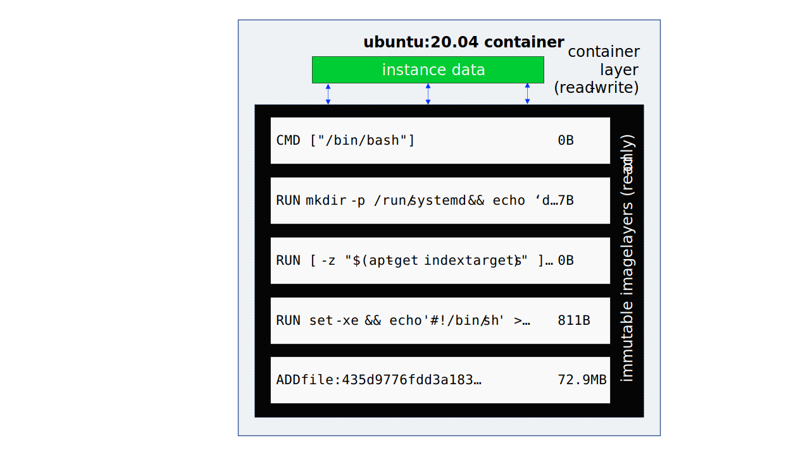

# Lesson 1- Use Our First Containers

## What are containers

Docker isn't the only container technology out there, but it is certainly the
most popular. And while we often think of containers as "mini-VMs," they
aren't. They run as programs on the host without the walls and separation that
VMs give us. If a program is running as `root` on a Docker container, it is
running as `root` on the host. They share the OS with the host which makes them
smaller and faster to start up than their larger VM cousins.

An _image_ is a software bundle that will run on a Docker host. A _container_
is an instance of that image, running or stopped. Images are the cookie
cutters; containers are the cookies.

An image is made up of multiple layers of software (each an image itself) along
with the metadata about how it should be assembled. Containers are read-only
copies of those images with a thin read-write layer on top for the ephemeral
instance data. We'll see more about this later.



Because of this, containers can be used as immutable infrastructure. The images
can be cloned and spun up and restarted and destroyed as needed, knowing that a
new copy can be instantiated as needed. Don't get too attached to any particular
instance. They are __cattle, not pets__.

## The Hello World Container

Instantiate your first Docker container with the
[docker run](https://docs.docker.com/engine/reference/run/) command.

```console
$ docker run hello-world
Unable to find image 'hello-world:latest' locally
latest: Pulling from library/hello-world
2db29710123e: Pull complete
Digest: sha256:faa03e786c97f07ef34423fccceeec2398ec8a5759259f94d99078f264e9d7af
Status: Downloaded newer image for hello-world:latest

Hello from Docker!
This message shows that your installation appears to be working correctly.

To generate this message, Docker took the following steps:
 1. The Docker client contacted the Docker daemon.
 2. The Docker daemon pulled the "hello-world" image from the Docker Hub.
    (amd64)
 3. The Docker daemon created a new container from that image which runs the
    executable that produces the output you are currently reading.
 4. The Docker daemon streamed that output to the Docker client, which sent it
    to your terminal.
...
```

`docker run` does a lot behind the scenes:

* looks in the image cache for the image
* downloads the image from Docker Hub (_if needed_)
* starts a container with the image
* allocates a filesystem
* adds the read-write layer
* sets up the network interface
* gets an IP address
* executes the process
* captures the output
* exits the container

## Interact with a Container

Run another container interactively.

```console
$ docker run -it ubuntu /bin/bash
Unable to find image 'ubuntu:latest' locally
latest: Pulling from library/ubuntu
e96e057aae67: Already exists
Digest: sha256:4b1d0c4a2d2aaf63b37111f34eb9fa89fa1bf53dd6e4ca954d47caebca4005c2
Status: Downloaded newer image for ubuntu:latest
root@8c0767c0de83:/#
```

You are left in a shell (`/bin/bash`) as `root` on the container, and the
container is still running.

* `-i` keeps STDIN open (short for `--interactive`)
* `-t` allocates a terminal (short for `--tty`)
* `ubuntu` is the image to use
* `/bin/bash` specifies the command to run, rather than the default

At the root prompt, exit and then start another container with the same
command. Then update Ubuntu's software index and install some packages.

```console
root@8c0767c0de83:/# exit
exit
$ docker run -it ubuntu /bin/bash
root@f0a3c974e524:/# apt-get update
...
Reading package lists... Done
root@f0a3c974e524:/# apt-get install -y wget cowsay recode jshon
Reading package lists... Done
Building dependency tree... Done
Reading state information... Done
The following additional packages will be installed:
...
done.
root@f0a3c974e524:/#
```

__Leave this container running at the root prompt.__

This time, Docker didn't have to download the `ubuntu` image again since it
already had it cached.

## Create an Image

In a second terminal window (leaving the container running in the other), list
the running containers with the [docker
ps](https://docs.docker.com/engine/reference/commandline/ps/) command.

```console
$ docker ps
CONTAINER ID   IMAGE     COMMAND       CREATED         STATUS         PORTS     NAMES
f0a3c974e524   ubuntu    "/bin/bash"   2 minutes ago   Up 2 minutes             happy_agnesi
```

`docker ps` shows our running container. You could also run with `-a` (short for
`--all`) to show all containers, running and stopped.

```console
$ docker ps -a
CONTAINER ID   IMAGE         COMMAND       CREATED         STATUS                     PORTS     NAMES
f0a3c974e524   ubuntu        "/bin/bash"   2 minutes ago   Up 2 minutes                         happy_agnesi
8c0767c0de83   ubuntu        "/bin/bash"   3 minutes ago   Exited (0) 3 minutes ago             nervous_swanson
9ebf98a22736   hello-world   "/hello"      3 minutes ago   Exited (0) 3 minutes ago             recursing_chebyshev
```

You can see our current container (`f0a3c974e524`), the first Ubuntu container we
exited (`8c0767c0de83`), and Hello World (`9ebf98a22736`), although your IDs
will be different.

Each container has a `Container ID` and a `Name`. If you don't assign a name
(we didn't) Docker assigns a random name. You can refer to a container by the at
least the first 5 digits of the `Container ID` or by the `Name`.

Let's make an image of the read-write layer on the running image (the one with
the software installed) by using the
[docker commit](https://docs.docker.com/engine/reference/commandline/commit/)
command. Then stop the first container (from the same, second window) using the
[docker stop](https://docs.docker.com/engine/reference/commandline/stop/)
command.

```console
$ docker commit f0a3c974e524 otherdevopsgene/chuck-norris-1
sha256:9c10ea95bec018c02ea18b9bc60da3377043bcd5bb884fc10fe981f02c58fc21
$ docker stop happy_agnesi
happy_agnesi
```

You could have used the `Container ID` (`f0a3c974e524`) or the `Name`
(`happy_agnesi`) in either command. I just showed an example of using each.

Images are named with a single word (e.g., `hello-world`, `ubuntu`) if they are
official Docker images. Otherwise they are named with your Docker Hub username
(if you have one, mine is `otherdevopsgene`), slash, an identifier
(`chuck-norris-1` in this case), colon, and then a tag (`latest` if you don't
specify). Unless you plan to push to Docker Hub it doesn't matter, but get in
the habit of naming them with the correct convention.

Notice that the container in the first window has stopped
(we didn't type `exit`).

```console
root@f0a3c974e524:/#
$
```

Check out the logs for the container with the
[docker log](https://docs.docker.com/engine/reference/commandline/logs/)
command. You'll see a replay of all the input and output from that container,
even after the container is stopped.

```console
$ docker logs happy_agnesi
root@f0a3c974e524:/# apt-get update
...
Reading package lists... Done
root@f0a3c974e524:/# apt-get install -y wget cowsay recode jshon
Reading package lists... Done
...
done.
root@f0a3c974e524:/#
```

## Run the Container

Let's look at the results of your interactive labor by starting your new image.

```console
$ docker run otherdevopsgene/chuck-norris-1 wget 'http://api.chucknorris.io/jokes/random' -qO-
{"categories":[],"created_at":"2020-01-05 13:42:21.795084",
"icon_url":"https://assets.chucknorris.host/img/avatar/chuck-norris.png",
"id":"UtbmnEoIT7qN881XnLjaMA","updated_at":"2020-01-05 13:42:21.795084",
"url":"https://api.chucknorris.io/jokes/UtbmnEoIT7qN881XnLjaMA",
"value":"Chuck Norris cuts a knife in two pieces, with a chunk of bread"}
```

Or you can try an even more unwieldy command.

```console
$ docker run otherdevopsgene/chuck-norris-1 /bin/bash -c "wget 'http://api.chucknorris.io/jokes/random' -qO- |\
    jshon -e value -u | recode html | /usr/games/cowsay"
 _____________________________________
/ Chuck Norris always knows the EXACT \
\ location of Carmen SanDiego.        /
 -------------------------------------
        \   ^__^
         \  (oo)\_______
            (__)\       )\/\
                ||----w |
                ||     ||
```

We will make it easier to run, and to create, in
[Lesson 2- Build an Image with Code](../02-Lesson/README.md).
